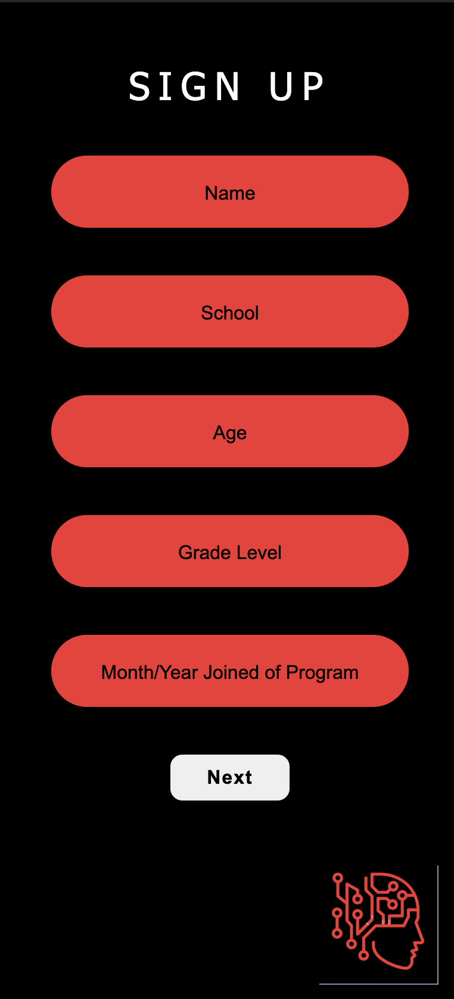
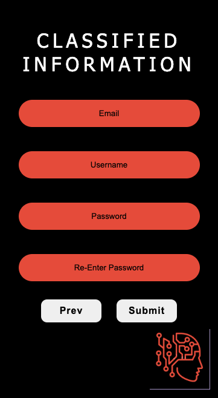
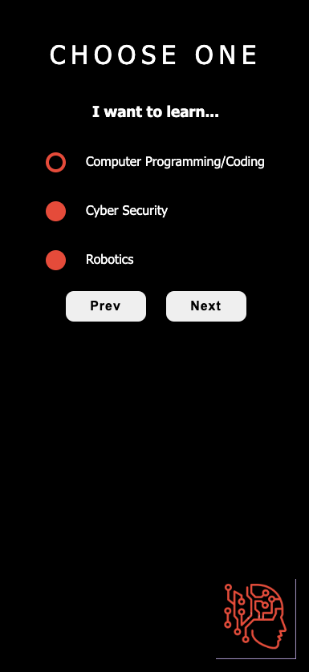
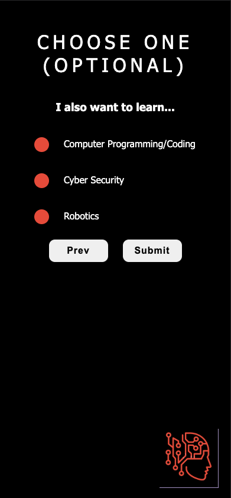

# Signup-Page

## Details

Front-End Sign-up and Choose pages for Early Transition In Tech Association.

## Technologies used

- HTML
- CSS
- JavaScript

## ScreenShot

[]

[]

[]

[]

## How to run

1. Download this software to your machine, e.g. `git clone https://github.com/rnbrietzke10/ETTA-sign-up-page.git`
2. Run live-server or drag index.html to your browser

## Site

Repo: https://github.com/rnbrietzke10/ETTA-sign-up-page
